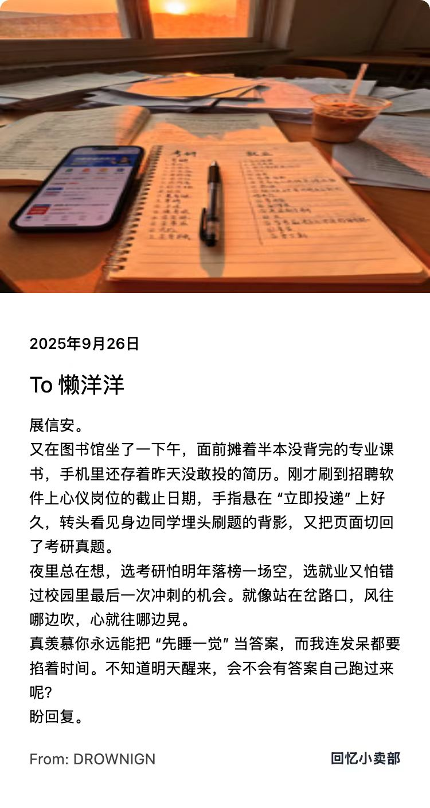

# 回忆明信片：AI 陪伴式情感交流平台

视频演示：https://www.bilibili.com/video/BV1DGnHzjE9R/

## 🖼️ 视觉展示

| 项目海报 | 明信片系列 |
|----------|------------|
|  |  |
|  |  |
|  |  |
|  |  |
|  |  |


## 一、用户类型、痛点与用户故事

### 1.1 用户类型
- **打工人**：生活压力大，节奏快，渴望从童年回忆中找到情感慰藉
- **大学生**：面临毕业、社交、未来规划等多重焦虑，需要情感支持


### 1.2 用户痛点
- 情感孤独感：缺乏深度共鸣的倾诉对象
- 回忆方式有限：传统回忆形式单一，缺乏互动性
- 压力释放渠道有限：现有方式难以缓解深层焦虑


### 1.3 用户故事
小宇盯着工位上的报表，半小时前递给前辈李姐的方案还躺在她桌角 —— 对方那句 "待会儿看"，终究是句客套。入职半年，他每天重复着整理数据、核对文件的工作，原本期待的成长毫无踪影；主动帮同事分担，换来的只有客气的 "谢谢"，晋升机会更是连影子都没见着；部门聚餐时，听着大家聊绩效指标和晋升路线，他插不上话，只剩尴尬地攥着水杯。

回到出租屋，小宇翻出大学室友的合照：四个男孩在操场看台举着啤酒笑，那时总聊未来的无限可能，可现在的自己，却困在打卡考勤和琐碎工作里。他对着照片叹气：每天忙忙碌碌，怎么反而越来越看不清方向？想提升却没人带，想歇会儿又怕被落下，难道打工就是这样吗？

这时，他点开 "回忆明信片" APP，给 "大大怪将军" 写信："每天做重复的工作，看不到成长，想请教前辈却总被敷衍，不知道这样的日子要熬多久，好怀念大学时对未来的期待……" 写完，他上传了下班拍的落日街角照，AI 立刻生成动漫：小小怪耷拉着脑袋站在路灯下，影子拉得老长，像极了他的迷茫。

十分钟后，大大怪的回信弹出来："小小怪下士，地球人的打工路本就有起伏，重复的日子不是熬，是在攒力气。我们侵略地球也总遇阻碍，可每次调整策略，不都是在靠近目标吗？没人带就自己找方向，慢慢来 —— 你的努力不是白费，是在为未来铺路。" 回信配着灰心星球星云图，大大怪叉腰站着，表情严肃却眼神温柔。

小宇点开语音通话，大大怪的声音传来："别被眼前的琐碎困住，先把手上的事做扎实，想提升就去学，想歇了就告诉我，灰心星球永远能让你喘口气！" 听着这话，他心里的闷堵散了些，仿佛真有个远方伙伴懂他的难。

挂了电话，小宇望着夜空的星星，慢慢挺直了背。他知道，打工路上的迷茫总会过去，只要不放弃找方向，总会看到光。


## 二、功能规划、优先级与开发计划

### 2.1 核心功能列表
- **角色发现与搜索**：提供角色库，支持浏览/搜索角色（如小小怪将军、哈利·波特等）
- **多模态交互（核心）**：
  - 文字聊天：与AI角色实时文字对话
  - 语音聊天（TTS & ASR）：实时语音交互，支持自定义音色
- **情感化内容生成**：
  - AI生成回信：根据对话内容生成符合角色风格的回信
  - 记忆与上下文：AI记住近期对话，实现连续深度交流
- **用户创作与分享**：分享精彩对话/回信/图片，社区互动


### 2.2 功能优先级
- **P0（必须拥有）**：明信片交流、语音聊天（TTS&ASR）、自定义角色（核心价值最小集）
- **P1（应该拥有）**：情感化内容生成、简单对话记忆、明信片分享
- **P2（将来拥有）**：主动发送明信片、复杂长期记忆、应用通知


## 三、AI模型选择

DeepSeek-V3 在以下方面取得最佳平衡，非常适合本项目：
- 中文理解与生成能力突出
- 长上下文记忆表现优异
- 成本控制合理
- 访问稳定性高

相较于 GPT 系列、Claude、Gemini 等模型，DeepSeek 对中文语境和情感表达的把握更精准，尤其适合需要高度依赖模型"演技"和情感深度的场景。

**核心期望**：
AI角色应像真实朋友一样：
- 能互相交流关心，提供情感慰藉
- 在用户低谷时给予力量
- 像真实人物一样发送"生活照片"
- 记住过往互动，保持关系连续性


## 四、系统架构概述

本项目分为四个主要服务，通过消息队列实现异步通信：
- 前端服务
- 后端服务
- AI代理服务
- RTC通信服务

### 整体架构图
```
用户界面 (Next.js)
    ↓ HTTP/WebSocket
后端服务 (Go + Gin) 
    ↓ RabbitMQ消息队列
AI代理服务 (Python + PocketFlow) 
```

## 核心模块规格

### 1. 前端模块 (Frontend)

#### 技术栈
- **框架**: Next.js 14 + TypeScript
- **样式**: Tailwind CSS + shadcn/ui
- **状态管理**: redux
- **路由**: Next.js

#### 主要组件
- **角色模块**: 角色搜索、浏览、筛选、创建、收藏
- **明信片模块**: 明信片搜索、浏览、筛选、创建
- **个人中心**: 登录、注册、个人资料

### 2. 后端模块 (Backend)

#### 技术栈
- **语言**: Go 1.21+
- **框架**: Gin Web Framework
- **ORM**: GORM (MySQL)
- **缓存**: Redis
- **存储**: MinIO对象存储
- **消息队列**: RabbitMQ
#### API设计
```go
// 用户管理
POST /api/v1/auth/login     // 用户登录
POST /api/v1/auth/register  // 用户注册
GET  /api/v1/users/profile  // 获取用户信息

// 角色管理
GET  /api/v1/characters     // 获取角色列表
POST /api/v1/characters     // 创建角色
GET  /api/v1/characters/:id // 获取角色详情

// 明信片管理
POST /api/v1/postcards      // 发送明信片
GET  /api/v1/postcards      // 获取明信片列表
GET  /api/v1/postcards/:id  // 获取明信片详情
```

#### 数据库设计
- **用户表 (users)**: 用户基本信息、偏好设置
- **角色表 (characters)**: AI角色信息、语音配置
- **明信片表 (postcards)**: 对话记录、多媒体内容

### 3. AI代理模块 (Agent)

#### 技术栈
- **语言**: Python 3.9+
- **流程引擎**: PocketFlow
- **LLM集成**: DeepSeek-V3 API
- **语音合成**: fishTTS服务
- **消息队列**: RabbitMQ

#### 核心流程节点
1. **消息验证节点**: 验证MQ消息格式
2. **明信片生成节点**: 调用LLM生成回复内容
3. **语音生成节点**: 文本转语音合成
4. **数据保存节点**: 持久化到数据库
5. **状态更新节点**: 更新处理状态

#### 核心功能
- **角色扮演**: 基于角色设定的对话生成
- **语音合成**: 文本转语音功能
- **异步处理**: 消息队列异步处理

## 数据流设计

### 1. 用户发送消息流程
```
用户输入 → 前端收集 → HTTP请求 → 后端验证 → 消息队列 → 
AI代理处理 → LLM生成 → 语音合成 → 数据库保存 → 前端展示
```

# AI角色扮演网站 - 运行说明文档

### 网络要求
- 稳定的互联网连接（用于访问DeepSeek-V3 API）
- 开放端口：3000, 8080, 3306, 6379, 5672, 15672, 9000, 9001

## 快速开始

### 1. 环境准备

```bash
# 克隆项目
git clone https://github.com/DROWNING2003/memo-shop.git
cd memo-shop

# 复制环境配置文件
cp .env.example .env
```

### 2. 配置环境变量

编辑 `.env` 文件，配置必要的环境变量：

### 3. 启动服务

#### 方式一：使用快速启动脚本（推荐）

```bash
# 赋予执行权限
chmod +x scripts/quick-start.sh

# 运行快速启动
./scripts/quick-start.sh
```

选择启动模式：
- **选项1**: 开发环境（仅基础服务）
- **选项2**: 完整环境（所有服务）

#### 方式二：手动启动

```bash
# 启动所有服务
docker-compose up -d

# 或者仅启动开发环境
docker-compose -f docker-compose.dev.yml up -d
```

### 4. 验证服务状态

```bash
# 检查服务健康状态
docker-compose ps

# 查看服务日志
docker-compose logs -f
```

## 服务访问地址

服务启动后，可以通过以下地址访问：

| 服务 | 访问地址 | 说明 |
|------|----------|------|
| 前端应用 | http://localhost:3000 | 用户界面 |
| 后端API | http://localhost:8080 | REST API服务 |
| API文档 | http://localhost:8080/swagger | Swagger UI |
| MySQL数据库 | localhost:3306 | 数据库管理 |
| Redis缓存 | localhost:6379 | 缓存服务 |
| RabbitMQ管理 | http://localhost:15672 | 消息队列管理 |
| MinIO控制台 | http://localhost:9001 | 对象存储管理 |

**默认登录信息：**
- RabbitMQ管理界面：guest/guest
- MinIO控制台：minioadmin/minioadmin123